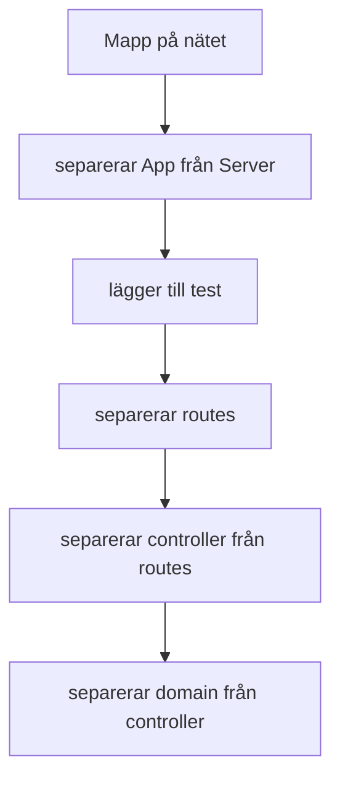

# edu-http-classic-js



## Förväntad tid 6:30 minuter, inklusive skriva app.js utantill.

### PC

[serve-favicon](https://expressjs.com/en/resources/middleware/serve-favicon.html)  
[nodemon](https://www.npmjs.com/package/nodemon)
[jest](https://www.npmjs.com/package/jest)
[path](https://www.npmjs.com/package/path)
[express](https://www.npmjs.com/package/express)

## Instructions

```bash
cd ~
cd ws
rm -rf http-classic #Om den finns
mkdir http-classic
cd http-classic
npm init -y
mkdir src
mkdir public
touch ./src/app.js
touch ./public/index.html
touch ./public/index.js
touch ./public/index.css
curl -L https://www.jensenyh.se/favicon.ico -o ./public/favicon.ico
npm pkg set scripts.start="node ./src/app.js"
npm pkg set scripts.dev="node --watch ./src/app.js"
npm pkg set scripts.test="jest"
npm install express
npm install path
npm install serve-favicon
git init
git add .
git commit -m "Initial commit"
```

  
  
## app.js

```bash
cat > ./src/app.js << 'EOF'
const express = require('express')
var favicon = require('serve-favicon')
var path = require('path')

const PORT = process.env.PORT || 3000

const app = express()
app.use(favicon(path.join(__dirname, '../public', 'favicon.ico')))
app.use(express.static('public'))

app.listen(PORT, console.log(`http server listening on port ${PORT}`))
EOF
```

### index.html

```bash
cat > ./public/index.html << 'EOF'
<!DOCTYPE html>
<html>
    <head>
        <link rel="stylesheet" href="/index.css">
    </head>
    <body>
        <h1>Hello World</h1>
        <script src='/index.js'/>
    </body>
</html>
EOF
```

### .gitignore

```bash
cat > .gitignore << 'EOF'
# Dependencies
/node_modules

# Build outputs
/build
/dist

# Storybook build directory
/storybook-static

# Environment files
.env
.env.local
.env.development.local
.env.test.local
.env.production.local

# Debug logs
npm-debug.log*
yarn-debug.log*
yarn-error.log*

# Editor directories and files
.vscode
.idea
*.swp
*.swo
.DS_Store

# OS generated files
Thumbs.db
Desktop.ini

# Test files
/coverage

# Compiled files
*.com
*.class
*.dll
*.exe
*.o
*.so

# Lock files
yarn.lock
package-lock.json
pnpm-lock.yaml
EOF
```

