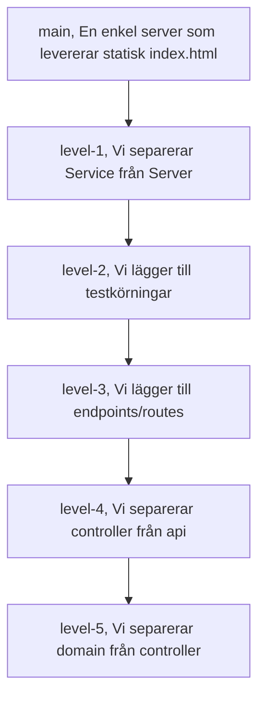

# edu-http-classic-js



## Förväntad tid 6:30 minuter, inklusive skriva server.js utantill.

## Förberedelse

> Registrera konto på [Heroku](https://devcenter.heroku.com/). Det är frivilligt, då det är en betaltjänst och kräver kreditkort. 
> Heroku är dock det absolut lättaste sättet att få en Node.js applikation i drift, så det kan vara värt det.

### PC

[serve-favicon](https://expressjs.com/en/resources/middleware/serve-favicon.html)  
[nodemon](https://www.npmjs.com/package/nodemon)
[jest](https://www.npmjs.com/package/jest)
[path](https://www.npmjs.com/package/path)
[express](https://www.npmjs.com/package/express)

## Instructions

```bash
cd ~
cd ws
rm -rf http-classic #Om den finns
mkdir http-classic
cd http-classic
npm init -y
mkdir src
mkdir public
touch ./src/server.js
touch ./public/index.html
touch ./public/index.js
touch ./public/index.css
curl https://www.jensenyh.se/favicon.ico -o ./public/favicon.ico
npm pkg set scripts.start="node ./src/server.js"
npm pkg set scripts.dev="node --watch ./src/server.js"
npm pkg set scripts.test="jest"
npm install express
npm install path
npm install serve-favicon
touch ./src/server.js
git init
git add .
git commit -m "Initial commit"
```

  
  
## server.js

```bash
cat > ./src/server.js << 'EOF'
const express = require('express')
var favicon = require('serve-favicon')
var path = require('path')

const PORT = process.env.PORT || 3000

const app = express()
app.use(favicon(path.join(__dirname, '../public', 'favicon.ico')))
app.use(express.static('public'))

app.listen(PORT, console.log(`http server listening on port ${PORT}`))
EOF
```

### index.html

```bash
cat > ./public/index.html << 'EOF'
<!DOCTYPE html>
<html>
    <head>
        <link rel="stylesheet" href="/index.css">
    </head>
    <body>
        <h1>Hello World</h1>
        <script src='/index.js'/>
    </body>
</html>
EOF
```

